# 🚀 GitHub Repository Analyzer

A powerful AI-powered GitHub repository analyzer that provides deep insights through comprehensive analysis, interactive visualizations, and intelligent Q&A capabilities using multiple MCP servers and advanced LLMs.

**Pre-configured for immediate use with public repositories - no API setup required.**

## 🎯 Key Features

### 🤖 **AI-Powered Analysis**
- **Comprehensive Data Gathering**: Automatically collects data from all MCP servers for every analysis
- **Parallel Processing**: Multiple servers run simultaneously for faster results
- **Smart Synthesis**: AI combines information from file content, structure, commits, and code search
- **Real-time Progress**: Track analysis progress with detailed status updates

### 📊 **Advanced Visualizations**
- **Interactive Repository Maps**: Treemap visualizations of repository structure
- **Dependency Graphs**: Network graphs showing project relationships
- **Code Activity Heatmaps**: Visual representation of development activity
- **Quality Metrics**: Interactive gauges and charts for code quality assessment

### 🔍 **Multiple Analysis Types**
- **Quick Overview**: Fast repository summary and insights
- **Comprehensive Analysis**: Full repository analysis with multiple dimensions
- **Security Analysis**: Security-focused analysis and vulnerability detection
- **Code Quality Analysis**: Advanced code quality, complexity, and pattern analysis
- **Smart Summarization**: AI-powered comprehensive repository summaries

### 💬 **Intelligent Q&A System**
- Ask specific questions about any repository
- Get detailed answers with context from the codebase
- Support for complex queries and follow-up questions
- Evidence-based responses with code examples

## 🏗️ System Architecture

```mermaid
graph TD
    %% User Interface Layer
    subgraph UI ["🎨 User Interface Layer"]
        direction TB
        STREAMLIT[🚀 Streamlit Web App]
        REPO_SELECT[📁 Repository Selector]
        CHAT_UI[💬 Q&A Chat Interface]
        ANALYSIS_UI[📊 Analysis Interface]
        SETTINGS_UI[⚙️ Settings Panel]
    end
    
    %% Core Processing Layer
    subgraph CORE ["🧠 Core Processing Layer"]
        direction TB
        AI_AGENT[🤖 AI Agent<br/>Smart Data Synthesis]
        ANALYSIS_ENGINE[⚡ Analysis Engine<br/>Multi-Dimensional Analysis]
        CODE_ANALYZER[🔍 Code Analyzer<br/>Quality & Complexity]
        REPO_VIZ[🗺️ Repository Visualizer<br/>Interactive Charts]
    end
    
    %% MCP Servers Layer
    subgraph MCP ["🔧 MCP Servers Layer"]
        direction TB
        FILE_SERVER[📄 File Content Server<br/>Code & Documentation]
        STRUCTURE_SERVER[📂 Repository Structure Server<br/>Directory Analysis]
        COMMIT_SERVER[📝 Commit History Server<br/>Development Patterns]
        SEARCH_SERVER[🔎 Code Search Server<br/>Pattern Detection]
    end
    
    %% External APIs Layer
    subgraph API ["🌐 External APIs Layer"]
        direction TB
        GITHUB_API[🐙 GitHub API<br/>Repository Data]
        GROQ_API[🧠 Groq AI API<br/>LLM Processing]
    end
    
    %% Data Management Layer
    subgraph DATA ["💾 Data Management Layer"]
        direction TB
        REPO_MANAGER[📋 Repository Manager<br/>Session & Cache]
        CONFIG_MGR[🔧 Configuration Manager<br/>Settings & Presets]
        SESSION_CACHE[💿 Session Cache<br/>Performance Optimization]
    end
    
    %% Main Data Flow
    STREAMLIT --> AI_AGENT
    STREAMLIT --> ANALYSIS_ENGINE
    STREAMLIT --> CODE_ANALYZER
    STREAMLIT --> REPO_VIZ
    
    REPO_SELECT --> REPO_MANAGER
    CHAT_UI --> AI_AGENT
    ANALYSIS_UI --> ANALYSIS_ENGINE
    SETTINGS_UI --> CONFIG_MGR
    
    %% AI Agent Connections
    AI_AGENT --> FILE_SERVER
    AI_AGENT --> STRUCTURE_SERVER
    AI_AGENT --> COMMIT_SERVER
    AI_AGENT --> SEARCH_SERVER
    AI_AGENT --> GROQ_API
    
    %% Analysis Engine Connections
    ANALYSIS_ENGINE --> FILE_SERVER
    ANALYSIS_ENGINE --> STRUCTURE_SERVER
    ANALYSIS_ENGINE --> COMMIT_SERVER
    ANALYSIS_ENGINE --> SEARCH_SERVER
    ANALYSIS_ENGINE --> GROQ_API
    
    %% MCP Server to GitHub API
    FILE_SERVER --> GITHUB_API
    STRUCTURE_SERVER --> GITHUB_API
    COMMIT_SERVER --> GITHUB_API
    SEARCH_SERVER --> GITHUB_API
    
    %% Data Management Connections
    REPO_MANAGER --> CONFIG_MGR
    REPO_MANAGER --> SESSION_CACHE
    AI_AGENT --> SESSION_CACHE
    ANALYSIS_ENGINE --> SESSION_CACHE
    
    %% Styling with better colors and larger nodes
    classDef uiLayer fill:#e3f2fd,stroke:#1976d2,stroke-width:3px,color:#0d47a1
    classDef coreLayer fill:#f3e5f5,stroke:#7b1fa2,stroke-width:3px,color:#4a148c
    classDef mcpLayer fill:#e8f5e8,stroke:#388e3c,stroke-width:3px,color:#1b5e20
    classDef apiLayer fill:#fff3e0,stroke:#f57c00,stroke-width:3px,color:#e65100
    classDef dataLayer fill:#fce4ec,stroke:#c2185b,stroke-width:3px,color:#880e4f
    
    class STREAMLIT,REPO_SELECT,CHAT_UI,ANALYSIS_UI,SETTINGS_UI uiLayer
    class AI_AGENT,ANALYSIS_ENGINE,CODE_ANALYZER,REPO_VIZ coreLayer
    class FILE_SERVER,STRUCTURE_SERVER,COMMIT_SERVER,SEARCH_SERVER mcpLayer
    class GITHUB_API,GROQ_API apiLayer
    class REPO_MANAGER,CONFIG_MGR,SESSION_CACHE dataLayer
```



## 🏗️ How the System Works (Simple Overview)

### 1. User Input
- The user interacts with a **web interface** (Streamlit app).
- They can enter a GitHub repository URL, ask questions, or choose analysis types.

### 2. Request Handling
- The Streamlit app receives the input and sends it to the **AI Agent** and **Analysis Engine**.

### 3. Core Processing
- The **AI Agent** coordinates the analysis.
- The **Analysis Engine** decides which data is needed (file content, structure, commit history, code search).

### 4. MCP Servers (Microservices)
- The system uses four main servers:
  - **File Content Server:** Gets file contents (README, code files).
  - **Repository Structure Server:** Maps the folder and file structure.
  - **Commit History Server:** Analyzes commit logs and development history.
  - **Code Search Server:** Finds code patterns, functions, and dependencies.

### 5. External APIs
- The servers fetch data from:
  - **GitHub API:** For repository data, files, commits, etc.
  - **Groq AI API:** For advanced language model (LLM) processing and smart answers.

### 6. Data Synthesis
- The AI Agent combines all the data from the servers.
- It uses the Groq LLM to generate summaries, answer questions, and provide insights.

### 7. Response Generation
- The system sends the results (analysis, answers, visualizations) back to the user via the Streamlit web interface.

---

## 🔽 System Flowchart (Simple, Top-to-Bottom)

```mermaid
flowchart TD
    A[User Input<br/>(Streamlit Web App)] --> B[Request Handling<br/>(Python Core)]
    B --> C[AI Agent & Analysis Engine]
    C --> D1[File Content Server]
    C --> D2[Repo Structure Server]
    C --> D3[Commit History Server]
    C --> D4[Code Search Server]
    D1 --> E[GitHub API]
    D2 --> E
    D3 --> E
    D4 --> E
    C --> F[Groq LLM API]
    D1 --> G[Data Synthesis]
    D2 --> G
    D3 --> G
    D4 --> G
    F --> G
    G --> H[Response Generation<br/>(Streamlit Web App)]
```

---

## 🛠️ Tech Stack

| Layer                | Technology/Tool         | Purpose                                      |
|----------------------|------------------------|----------------------------------------------|
| **Frontend**         | Streamlit              | User interface (web app)                     |
| **Core Logic**       | Python                 | Main programming language                    |
| **AI/LLM**           | Groq API (LLM)         | Natural language understanding & generation  |
| **Microservices**    | Python (Flask/FastAPI) | MCP servers for modular data processing      |
| **Data Source**      | GitHub API             | Repository data, files, commits, etc.        |
| **Visualization**    | Streamlit, Mermaid     | Interactive charts, flowcharts               |
| **Session/Config**   | Python modules         | Session management, configuration            |

---

## 🚀 Quick Start

### 1. **Installation**
```bash
# Clone the repository
git clone <repository-url>
cd repo-analyzer

# Install dependencies
pip install -r requirements.txt
```

### 2. **Start the Application**
```bash
# Start the Streamlit app
streamlit run app.py
```

### 3. **Start MCP Servers (Recommended)**
```bash
# Start all MCP servers with one command
python start_servers.py
```

## 📖 Usage Guide

### **Step 1: Select Repository**
1. Enter a GitHub repository URL in the sidebar
2. Click "Analyze Repository" to set it as current
3. View basic repository information

### **Step 2: Choose Analysis Type**

#### **🔍 Analysis Tab**
- **Quick Overview**: Fast repository summary
- **Comprehensive Analysis**: Full analysis with multiple dimensions
- **Security Analysis**: Security-focused analysis
- **Code Quality**: Advanced code quality and complexity analysis
- **Visualizations**: Interactive repository maps and graphs
- **Smart Summary**: AI-powered comprehensive summaries

#### **💬 Q&A Chat Tab**
- Ask specific questions about the repository
- Use quick question buttons for common queries
- Get detailed answers with code examples

#### **⚙️ Settings Tab**
- Configure analysis parameters
- Set file size and count limits
- Enable/disable caching
- Choose analysis presets

### **Step 3: View Results**
- **Real-time Progress**: Track analysis with detailed status updates
- **Interactive Visualizations**: Explore repository structure with charts
- **AI Summaries**: Get AI-powered insights and recommendations
- **Tool Transparency**: See which MCP tools were used for each query

## 🛠️ Technical Components

### **Core Architecture**
```
repo-analyzer/
├── app.py                    # Main Streamlit application
├── start_servers.py          # MCP server startup script
├── requirements.txt          # Python dependencies
└── src/
    ├── agent/               # AI agent with MCP integration
    ├── analysis/            # Analysis engine and tools
    ├── servers/             # FastMCP v2 servers
    ├── ui/                  # User interface components
    └── utils/               # Utilities and configuration
```

### **MCP Servers**
- **File Content Server**: Retrieve and analyze file contents
- **Repository Structure Server**: Analyze directory trees and organization
- **Commit History Server**: Track changes and development patterns
- **Code Search Server**: Search for code patterns and dependencies

### **Analysis Types**
- **Quick**: Fast analysis with basic insights (20 files, 2 depth)
- **Standard**: Comprehensive analysis with metrics (50 files, 3 depth)
- **Deep**: In-depth analysis with all features (100 files, 5 depth)
- **Security**: Security-focused analysis (75 files, 4 depth)

## 🔑 API Requirements

### **Required**
- **Groq API Key**: For AI-powered analysis and Q&A
  - Get from: https://console.groq.com/
  - Supports models: llama-3.1-70b-versatile, llama-3.1-8b-instant

### **Optional**
- **GitHub Token**: For higher rate limits and private repository access
  - Get from: https://github.com/settings/tokens

## 📊 Example Use Cases

### **Repository Exploration**
```
Question: "What is this repository about and what are its main features?"
Analysis: Quick overview with AI summary
```

### **Code Quality Assessment**
```
Question: "How well is this codebase structured and what are the quality metrics?"
Analysis: Code quality analysis with metrics and patterns
```

### **Security Review**
```
Question: "Are there any security vulnerabilities in this codebase?"
Analysis: Security analysis with pattern detection
```

### **Dependency Analysis**
```
Question: "What dependencies does this project use and are there any security issues?"
Analysis: Comprehensive analysis with dependency focus
```

## 🧪 Testing

Run the comprehensive test suite:
```bash
python test_enhanced_system.py
```

## 🚀 Advanced Usage

### **Programmatic Analysis**
```python
from src.analysis.analysis_engine import analyze_repository
from src.agent.ai_agent import ask_repository_question

# Comprehensive analysis
result = analyze_repository(
    repo_url="https://github.com/example/repo",
    analysis_type="comprehensive",
    preset="deep"
)

# Ask specific questions
answer, tools_used = ask_repository_question(
    "What are the main architectural patterns?",
    "https://github.com/example/repo"
)
```

## 🤝 Contributing

1. Fork the repository
2. Create a feature branch
3. Make your changes
4. Add tests for new functionality
5. Submit a pull request

## 📝 License

This project is licensed under the MIT License - see the LICENSE file for details.

---

**Built with ❤️ using Streamlit, FastMCP v2, Groq AI, and Advanced LLMs**
